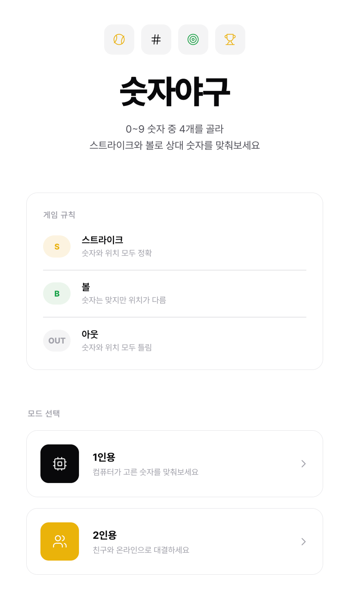

# 숫자야구 (Number Baseball)

실시간 온라인 대전을 지원하는 숫자야구 웹 게임

> **[DEMO LINK](https://yeonju-number-baseball.vercel.app)**



<br/>

## 프로젝트 소개

0~9 중 중복 없는 4자리 숫자를 맞추는 **숫자야구 게임**입니다.
혼자서 컴퓨터와 대결하는 **1인용 모드**와, 친구와 실시간으로 대결하는 **2인용 온라인 대전 모드**를 지원합니다.

### 게임 규칙

| 판정              | 설명                      |
| ----------------- | ------------------------- |
| **스트라이크(S)** | 숫자와 위치 모두 정확     |
| **볼(B)**         | 숫자는 맞지만 위치가 다름 |
| **아웃(OUT)**     | 일치하는 숫자 없음        |

4스트라이크(4S)를 달성하면 승리합니다.

<br/>

## 주요 기능

### 1인용 모드

- 컴퓨터가 생성한 랜덤 숫자를 추측
- 시도 횟수 기록 및 즉시 재도전 가능
- 클라이언트 사이드에서 모든 로직 처리

### 2인용 온라인 대전

- **방 생성 & 참가** — 6자리 방 코드를 통한 매칭
- **링크 공유** — 방 코드/링크를 친구에게 공유
- **비밀 숫자 설정** — 각 플레이어가 상대에게 맞출 숫자를 설정
- **턴 기반 대결** — 교대로 추측하며 먼저 맞추는 사람이 승리
- **실시간 동기화** — Supabase Realtime + 폴링 하이브리드 방식
- **턴 알림** — 효과음, 브라우저 알림, 탭 타이틀 깜빡임으로 내 차례 알림
- **게임 종료 시 비밀 숫자 공개** — 참가 플레이어 숫자를 투명하게 공개

<br/>

## 기술 스택

### Core

| 기술           | 버전 | 설명                              |
| -------------- | ---- | --------------------------------- |
| **Next.js**    | 16   | App Router 기반 풀스택 프레임워크 |
| **React**      | 19   | UI 렌더링                         |
| **TypeScript** | 5    | 정적 타입 시스템 (strict 모드)    |

### Styling

| 기술                      | 설명                                                               |
| ------------------------- | ------------------------------------------------------------------ |
| **Tailwind CSS v4**       | 유틸리티 기반 스타일링                                             |
| **CSS Custom Properties** | 테마 변수 관리                                                     |
| **커스텀 애니메이션**     | fadeIn, slideUp, popIn, shake, confetti 등 게임 UX 전용 애니메이션 |
| **Pretendard**            | 한국어 최적화 웹폰트                                               |

### Backend & Database

| 기술                      | 설명                                 |
| ------------------------- | ------------------------------------ |
| **Supabase (PostgreSQL)** | 게임 방 상태 및 플레이어 데이터 저장 |
| **Supabase Realtime**     | PostgreSQL 변경사항 실시간 구독      |
| **Next.js API Routes**    | 서버 사이드 게임 로직 및 데이터 검증 |

### Dev Tools

| 기술         | 설명                                      |
| ------------ | ----------------------------------------- |
| **ESLint**   | 코드 린팅                                 |
| **Prettier** | 코드 포맷팅 (+ Tailwind 클래스 자동 정렬) |

<br/>

## 아키텍처

### 프로젝트 구조

```
app/
├── api/rooms/                  # API Routes (서버 사이드)
│   ├── route.ts                #   POST - 방 생성
│   └── [roomCode]/
│       ├── route.ts            #   GET  - 방 상태 조회
│       ├── join/route.ts       #   POST - 방 참가
│       ├── secret/route.ts     #   POST - 비밀 숫자 제출
│       └── guess/route.ts      #   POST - 추측 제출
├── components/                 # UI 컴포넌트
│   ├── NumberPad.tsx           #   숫자 입력 패드 (0~9)
│   ├── GuessHistory.tsx        #   추측 히스토리 (S/B 표시)
│   ├── VictoryOverlay.tsx      #   승리 화면 + 컨페티 효과
│   ├── TurnNotificationBanner.tsx  #   턴 알림 배너
│   ├── WaitingOpponent.tsx     #   상대 대기 화면
│   ├── ShareLink.tsx           #   방 링크 공유
│   ├── GameHeader.tsx          #   게임 헤더
│   └── Icons.tsx               #   커스텀 SVG 아이콘
├── hooks/                      # 커스텀 React Hooks
│   ├── useMultiplayerGame.ts   #   멀티플레이 상태 관리 + 실시간 동기화
│   └── useTurnNotification.ts  #   턴 알림 (사운드/브라우저 알림/타이틀)
├── lib/                        # 유틸리티
│   ├── game.ts                 #   게임 핵심 로직 (판정, 검증)
│   ├── room-code.ts            #   방 코드 생성
│   ├── sound.ts                #   Web Audio API 효과음
│   ├── supabase.ts             #   Supabase 클라이언트 (브라우저용)
│   └── supabase-server.ts      #   Supabase 클라이언트 (서버용)
├── single/page.tsx             # 1인용 게임 페이지
├── multi/
│   ├── page.tsx                # 멀티플레이 로비
│   └── [roomCode]/page.tsx     # 멀티플레이 게임 방
├── page.tsx                    # 홈 (모드 선택)
└── globals.css                 # 전역 스타일 + 애니메이션 정의
```

### 실시간 동기화 전략

안정적인 멀티플레이를 위해 **하이브리드 방식**을 채택했습니다.

```
┌─────────────────────────────────────────────────┐
│  Client                                         │
│                                                 │
│  ┌──────────────┐    ┌──────────────────────┐   │
│  │   Supabase   │    │   Polling (3초 간격)  │   │
│  │   Realtime   │    │   (Fallback)         │   │
│  └──────┬───────┘    └──────────┬───────────┘   │
│         │                       │               │
│         └───────────┬───────────┘               │
│                     ▼                           │
│            API 재조회 (GET)                      │
│                     │                           │
│                     ▼                           │
│           React 상태 업데이트                     │
└─────────────────────────────────────────────────┘
```

- **Primary**: Supabase Realtime으로 DB 변경사항을 즉시 감지
- **Fallback**: Realtime 연결 실패 시 3초 간격 폴링으로 자동 전환
- **데이터 완전성**: 이벤트 수신 시 API를 재조회하여 최신 상태 보장

### 보안 설계

- **토큰 기반 인증** — UUID 토큰으로 플레이어 식별 (LocalStorage 저장)
- **비밀 숫자 분리 저장** — `player_secrets` 테이블에 별도 저장하여 게임 종료 전 노출 방지
- **서버 사이드 검증** — 모든 게임 액션(추측, 비밀 숫자 설정)을 API Route에서 검증
- **Service Role 분리** — 클라이언트(anon key)와 서버(service role key)를 분리 운용

### 멀티플레이 게임 플로우

```
방 생성 → 상대 대기 → 비밀 숫자 설정 → 턴 기반 대결 → 승리 판정
  (waiting)         (setup)          (playing)      (finished)
```

1. **waiting** — Player 1이 방을 생성하고 상대를 기다림
2. **setup** — 양쪽 플레이어가 비밀 숫자를 설정
3. **playing** — 교대로 추측, 스트라이크/볼 판정
4. **finished** — 4S 달성 시 승리, 양쪽 비밀 숫자 공개

<br/>

## 사용된 주요 의존성

| 패키지                  | 용도                              |
| ----------------------- | --------------------------------- |
| `next`                  | App Router 기반 풀스택 프레임워크 |
| `react` / `react-dom`   | UI 렌더링                         |
| `@supabase/supabase-js` | DB 연동 + 실시간 구독             |
| `pretendard`            | 한국어 웹폰트                     |
| `tailwindcss`           | 유틸리티 CSS 프레임워크           |
| `typescript`            | 정적 타입 시스템                  |
| `eslint` + `prettier`   | 코드 품질 관리                    |
